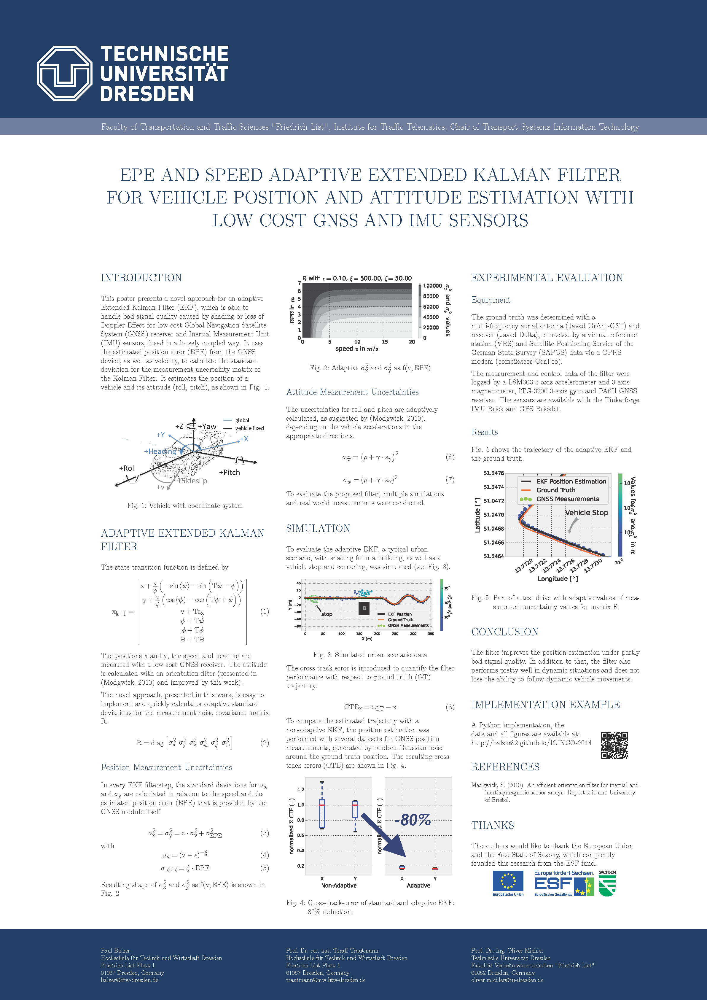
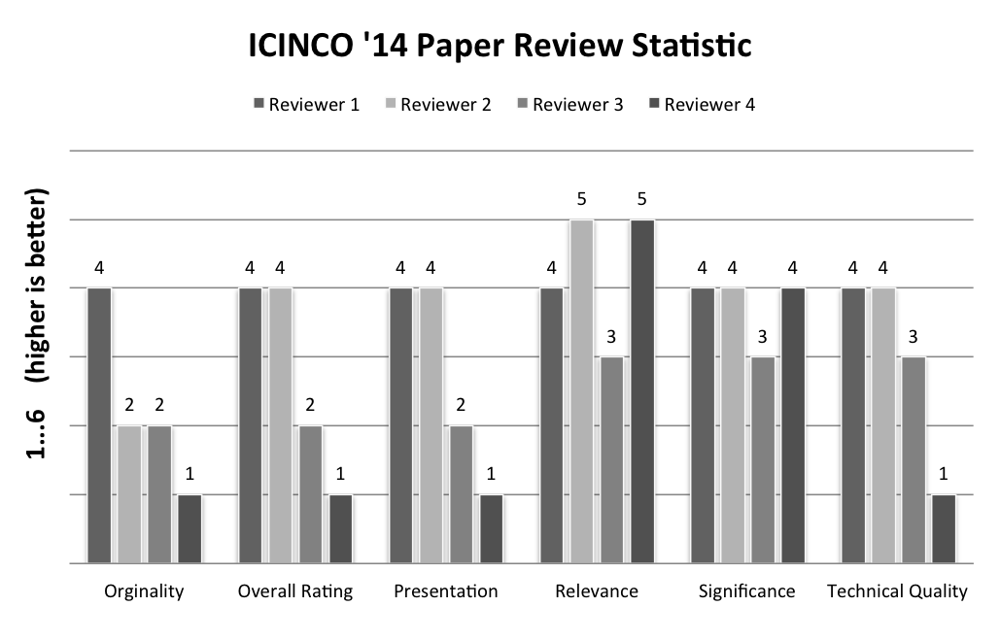

ICINCO-2014
===========

Paper for [11th International Conference on Informatics in Control, Automation and Robotics (ICINCO)](http://icinco.org/), 1st - 3rd Sep. 2014, Vienna, Austria

## EPE and Speed Adaptive Extended Kalman Filter for Vehicle Position and Attitude Estimation with Low Cost GNSS and IMU Sensors

Authors: Paul Balzer ~ Toralf Trautmann ~ Oliver Michler

This paper presents a novel approach for an adaptive Extended Kalman Filter (EKF), which is able to handle bad signal quality caused by shading or loss of Doppler Effect for low cost Global Navigation Satellite System (GNSS) receiver and Inertial Measurement Unit (IMU) sensors fused in a loosely coupled way. It uses the estimated position error as well as the speed to calculate the standard deviation for the measurement uncertainty matrix of the Kalman Filter. The filter is very easy to implement, because some conversions of the measurement, as well as the state variables, are made to reduce the complexity of the Jacobians, which are used in the EKF filter algorithm. The filter implementation is tested within a simulation and with real data and shows significantly better performance, compared to a standard EKF. The developed filter is running in realtime on an embedded device and is able to perform position and attitude estimation of a vehicle with low cost sensors.

*Available soon in the Conference Proceedings...*

### Poster

### Code

Take a look at the [IPython Notebook](http://nbviewer.ipython.org/github/balzer82/ICINCO-2014/blob/master/Extended-Kalman-Filter-CTRV-Attitude.ipynb)

### Review Statistics

